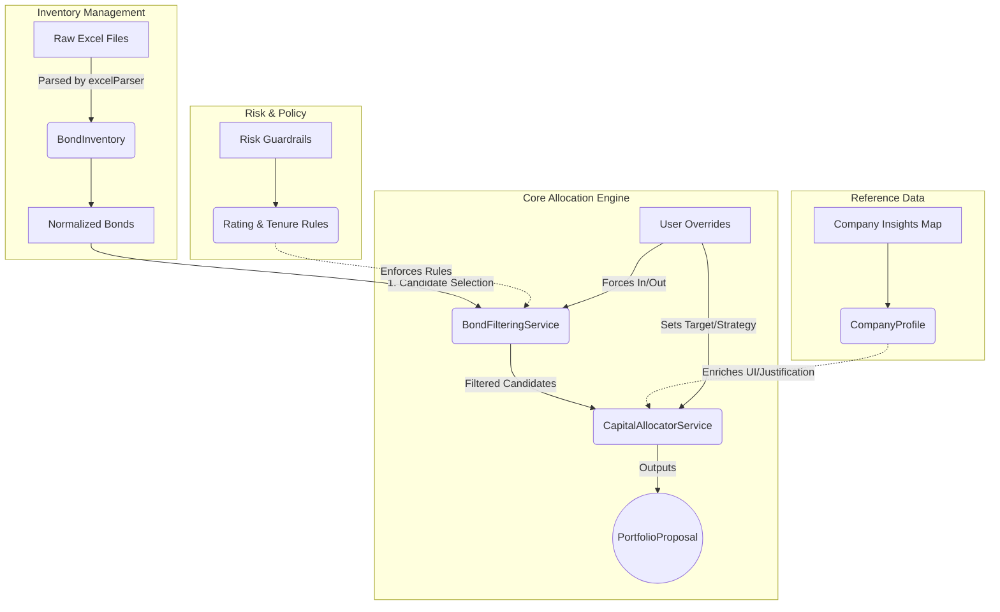
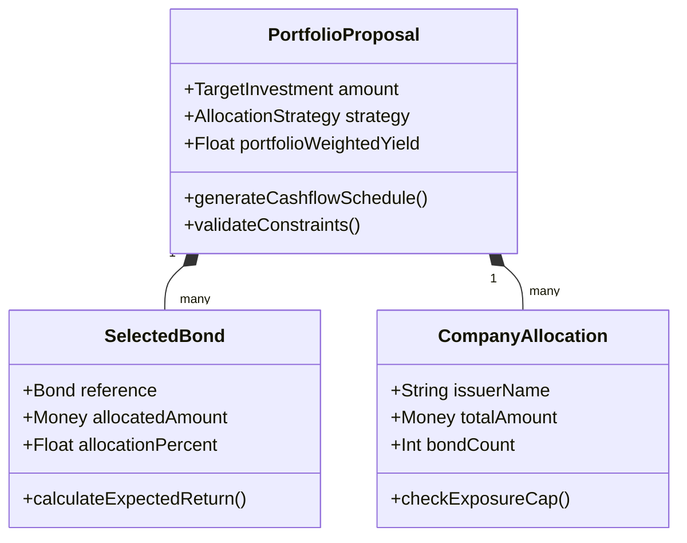
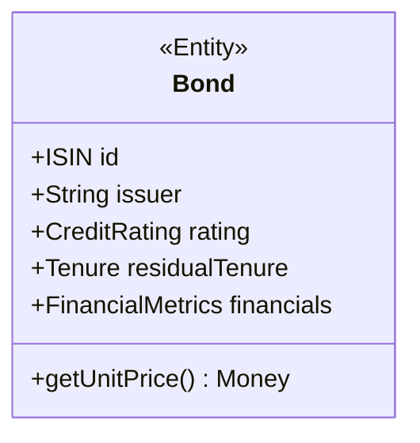

# Domain-Driven Design (DDD) Architecture

## 1. Domain Overview
The **Bond Portfolio Builder** is a specialized engine designed to take a raw universe of corporate bonds (inventory) and automatically generate an optimized, risk-managed investment portfolio. It strictly enforces business rules (e.g., maximum company exposure, tenure limitations, credit rating minimums) while respecting the physical constraints of the bond market (discrete unit prices, maximum tradable face values).

## 2. Bounded Contexts

Based on the Domain-Driven Design analysis, the system is decomposed into four primary bounded contexts:

### 2.1 Inventory Management Context (Supporting Domain)
**Purpose:** Handles the ingestion, parsing, and normalization of raw bond data from external sources (Excel files).
- **Aggregates & Entities:**
  - `BondInventory` (Aggregate Root): Represents the current snapshot of all available bonds in the market.
  - `Bond` (Entity): A unique financial instrument identified by its ISIN.
- **Value Objects:**
  - `ISIN`: Unique identifier.
  - `FinancialMetrics`: Yield to Maturity (YTM), Coupon Rate, Unit Price, Face Value, Tradable Quantity.
  - `CreditRating`: The credit score (e.g., AAA, AA+, A-) and Outlook.
  - `Tenure`: Residual maturity in months.

### 2.2 Risk & Policy Context (Generic Subdomain)
**Purpose:** Defines the strict risk parameters and guardrails for investment.
- **Aggregates & Entities:**
  - `RiskPolicy` (Aggregate Root): The set of rules governing a valid portfolio.
- **Value Objects:**
  - `RatingTier`: Categorization of ratings (e.g., Tier 1: AAA, Tier 4: BBB).
  - `ExposureCap`: Rule defining the maximum allowable allocation to a single issuer (e.g., 15%).
  - `TenureLimit`: Rule mapping acceptable credit ratings to maximum investment horizons.

### 2.3 Reference Data Context (Supporting Domain)
**Purpose:** Manages qualitative insights and metadata about bond issuers to enrich the user's decision-making process.
- **Aggregates & Entities:**
  - `CompanyProfile` (Aggregate Root): Information about an issuer (e.g., Core Focus, Guarantor, Analyst Notes).
  - Identified by `IssuerName`.

### 2.4 Portfolio Allocation Engine (Core Domain)
**Purpose:** The heart of the application. It applies constraints, user overrides, and yield-maximization strategies to allocate capital discretely.
- **Aggregates & Entities:**
  - `PortfolioProposal` (Aggregate Root): The final generated investment plan.
  - `SelectedBond` (Entity): A bond that has been chosen for the portfolio, tracking its specific allocated capital and portfolio weight.
  - `CompanyAllocation` (Entity): Tracks the aggregated exposure to a specific issuer to ensure compliance with the `ExposureCap`.
- **Value Objects:**
  - `TargetInvestment`: The total capital to deploy.
  - `AllocationStrategy`: e.g., 'Smart' (Yield Maximizer) vs 'Balanced' (Equal Weight).
  - `UserOverride`: A user's explicit directive to include or exclude a bond against the standard policy, including a `Justification`.
- **Domain Services:**
  - `BondFilteringService`: Progressively filters the `BondInventory` through stages (Liquid, Yield, Tenure, Rating) to produce candidate bonds.
  - `CapitalAllocatorService`: Discretely distributes the `TargetInvestment` across candidates, respecting unit prices and `ExposureCap`.

---

## 3. Context Map & Data Flow

---

## 4. Deep Dive: Core Domain Model (Aggregates)

### Aggregate: PortfolioProposal
The primary output. Must maintain the invariant that **total allocated capital <= target investment**, and that **no individual company allocation exceeds 15%** (unless a single physical unit of a bond forces it to exceed 15% to prevent a zero-allocation deadlock).

### Aggregate: Bond
The fundamental trading unit.

## 5. Domain Events (Proposed for Future Extensibility)
To decouple the frontend UI from the engine, the system should ideally emit Domain Events during the generation lifecycle:
- `InventoryParsedEvent`: Triggered when a new Excel file is uploaded.
- `BondEliminatedEvent`: Emitted during Stage 1-5 filtering (used to populate the "Eliminated Bonds" UI).
- `UserOverrideAppliedEvent`: Emitted when a user explicitly includes an otherwise eliminated bond.
- `PortfolioGeneratedEvent`: Emitted when the Capital Allocator successfully deploys the budget.

## 6. Ubiquitous Language Glossary
- **ISIN**: International Securities Identification Number.
- **Tradable FV (Face Value)**: The maximum amount of the bond available for purchase in the current inventory.
- **Unit Price**: The physical, discrete cost of a single bond unit. Allocations must be multiples of this.
- **Zero-Allocation Deadlock**: An edge case where strict percentage caps prevent buying even a single unit of a bond.
- **Smart Strategy**: Allocation prioritizing highest yield.
- **Balanced Strategy**: Allocation aiming for equal capital distribution among selected bonds.

